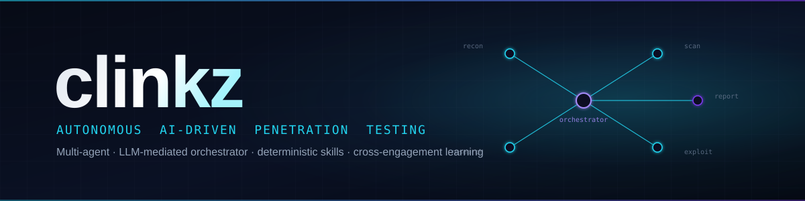

<p align="center">
  
</p>

# Clinkz

**Autonomous AI penetration testing system powered by multi-agent collaboration.**


## Overview

Clinkz is an autonomous, multi-agent AI system that performs end-to-end black-box penetration testing. Give it a target scope and it produces a professional pentest report — no human intervention required.

Agents collaborate in real-time through an LLM-mediated Orchestrator, dynamically discovering and executing security tools as needed. The system follows the MITRE ATT&CK framework and OWASP WSTG methodology to ensure comprehensive coverage.

## Architecture

```
                         ┌──────────────────┐
                         │   Orchestrator   │
                         │  (Central Brain) │
                         └────────┬─────────┘
                                  │
        Recon (sequential) ──► Scan + Research + Exploit (concurrent) ──► Report
              │                    │         │           │
              ▼                    ▼         ▼           ▼
        ┌─────────────────────────────────────────────────────┐
        │                  Tool Resolver                      │
        │      MCP Servers   │   Local CLI (with fallback)    │
        └─────────────────────────────────────────────────────┘
                                  │
                ┌─────────────────┴────────────────┐
                ▼                                  ▼
       Engagement state                 Persistent KB
       (clinkz.db)                      (clinkz_knowledge.db,
                                         cross-engagement)
```

**How it works:**

1. The **Orchestrator** validates scope and runs **Recon** sequentially
2. **Scan**, **Research**, and **Exploit** then run **concurrently**, sharing SQLite state. Exploit's only hard dependency is Scan — it starts as soon as Scan completes and never waits for Research (Research's runbook is folded in only if it has already finished)
3. **Recon** discovers subdomains, ports, services, and tech stack
4. **Scan** crawls + fuzzes every HTTP service and enumerates non-HTTP services (FTP/SSH/SMB/DB), under its own wall-clock budget (`SCAN_TIME_BUDGET`) so an over-running phase returns a partial attack surface instead of being force-killed and returning none. For single-page apps it adds **API surface discovery** (`agents/_route_discovery.py`, behind a pluggable discoverer seam) — because on an SPA the `/api`+`/rest` routes *are* the surface and an HTML/JS crawl cannot see them. The frontend declares the API contract, so Clinkz reads it: `agents/_js_api_mining.py` mines the served bundles for **HTTP call sites** (fetch/XHR/axios/Angular `HttpClient`/navigation) and recovers each one's method, URL template, query parameters and request **body shape**, resolving minified class-field bindings and scoping a body shape to its enclosing function. OpenAPI and GraphQL introspection are used when served (a *disabled* introspection is reported as such, never guessed around). What the source can't say is learned from the live target using **safe methods only** (`agents/_api_schema.py`): `OPTIONS` for a resource's `Allow` header, and a collection's own `GET` representation for the fields its writes accept. No discoverer carries a hardcoded endpoint, body-field or route-word list for any application. Crawl-safety skips links that mutate the target (WAF/security toggles, logout) so the shared session is never poisoned for later phases
5. **Research** queries the persistent KB for known techniques and live-searches the web for new CVEs/writeups (Gemini 3.1 Flash-Lite with native Search Grounding), under a hard wall-clock budget, persisting results back to the KB
6. **Exploit** plans tests with an LLM and executes deterministic `_test_*` skills (all are adaptive multi-phase methodologies — the injection family spans SQLi, NoSQL, SSTI, XSS, CMDi, LFI, …)
7. **Critic** validates findings; **Report** emits JSON + Markdown

Phase agents follow **deterministic step sequences with LLM checkpoints** (no free-form ReAct). Confirmed capabilities are recorded to the persistent KB's Layer-2 capability memory so future engagements adapt.

## Features

- **Concurrent multi-agent execution** — Scan, Research, and Exploit run in parallel through an LLM-mediated orchestrator
- **Deterministic skills + LLM checkpoints** — Each `_test_*` is a contract: if the vuln is present it MUST be found; LLMs only step in at named planning/synthesis points
- **Adaptive methodologies** — every `_test_*` is a multi-phase methodology: the injection family (SQLi, NoSQL, SSTI, XSS, CMDi, LFI, …) maps → fingerprints (SQL dialect / NoSQL carrier / template engine / shell) → ranks → LLM-synthesizes → verifies; SSTI sends polyglot arithmetic probes and is read-back aware for second-order Pug; CMDi candidacy uses a reflection-guarded echo-canary probe so injection surfaces even when the base command writes only to stderr
- **Gray-box discovery engine** — when an engagement supplies a source tree, `src/clinkz/discovery/` ingests it (bounded regex, no whole-program analysis) and derives *Δ-capability × untrusted-channel-reachability × provable-impact* hypotheses that union into the exploit plan alongside the LLM and deterministic plans. Ingestion is **cross-language** behind a `SourceIngestor` seam (`select_ingestor` picks per source tree): a Java ingestor (servlet / param-bag / typed path-param / log-sink idioms) and a JS/TS **Node/Express backend** ingestor (Express route entrypoints incl. cross-file factory-per-file handlers; `axios`/`fetch`/`fs` sink shapes; `package.json` manifest) — the JS path is **live-proven on OWASP Juice Shop**, surfacing its own-code SSRF (`fetch(req.body.imageUrl)`) and confirming it out-of-band (P6) on the running instance. A class-generic capability catalog holds three classes today — **SSRF** (`openConnection` / `axios.get` egress → `_test_ssrf`), **file read** (`new File(pathParam)` / `fs.readFile` → `_test_lfi`), and **Log4Shell** (`log4j-core` log-sink JNDI egress → `_test_log4shell`) — each learned from the target's own source with no target literal, N/A by construction on a patched/absent instance; the SSRF/file-read classes are language-agnostic (the same catalog entry fires on Java or Node)
- **Out-of-band (P6) confirmation** — a blind capability is confirmed only when an inbound callback bearing a Clinkz-minted, single-use nonce reaches a Clinkz-owned receive-only DNS+HTTP collaborator (zero-FP by construction: the nonce rides only the one outbound probe). Payloads come from CLINKZ-OWNED nonce-only templates (structural exfil guardrail — target data cannot ride the channel). This is the confirmation oracle for blind SSRF and the **Log4Shell flagship** (CVE-2021-44228), live-validated end-to-end on Vulhub Solr 8.11.0 via a `${jndi:dns://…}` callback. Disabled by default (unchanged black-box floor)
- **Client-side execution (P7) confirmation** — three classes (DOM XSS, a reflected/stored XSS whose landing context is client-rendered, and Content-Security-Policy bypass) have no server-side observation that proves the defining effect, so they previously recorded honest *unproven leads*. P7 is the missing witness: a headless browser (`src/clinkz/browser/`, Playwright + Chromium, resolved by capability) loads the page with CSP enforcement **left on**, and the class confirms only when a Clinkz-minted single-use nonce is returned by a call from inside the page's JavaScript context to a Clinkz-owned in-page channel — while a second nonce minted alongside it and injected nowhere stays silent. Inert reflected bytes cannot call a function, which is precisely the confounder that made earlier DOM-XSS "confirmations" phantoms. Nothing the page emits (console text, DOM, headers) can influence a verdict. The browser runs **where the target is reachable** — in the default docker tool-mode that is inside the `clinkz-tools` container, since the engagement's address has been rewritten to a container-network alias no host browser can route to — so P7 is available in an ordinary `clinkz scan` with nothing for the operator to arrange. Live-validated end-to-end through `clinkz scan` across DVWA's four security levels: DOM XSS confirms at low/medium/high and is **silent at impossible**. CSP bypass has the oracle but not yet a class — the Exploit agent dispatches nineteen methodologies and none is CSP, so that capability is proven at the primitive level (a reused static nonce, and a same-origin script gadget under `script-src 'self'`) and is not yet reachable from an engagement report. Absent or failing, the lead stands unchanged — a missing browser costs coverage, never honesty
- **Engagement setup** — an engagement refuses to start without an `AuthorizationRecord` (authorizing party, role, contact, authorization reference, permitted-technique list, emergency contact — every field required, no flag to skip it), and an optional `EngagementWindow` is a hard stop re-checked on every request. Credentials arrive from an untracked file or a no-echo prompt, are `SecretStr`, are never attached to the persisted scope, and are redacted at every artifact writer. `--dry-run` enumerates what the engagement WOULD do — targets, classes, the destructive categories that will be refused — and sends nothing
- **The report bundle carries no usable session token** — redaction removes a string both for what it *is* (a registered value) and for what it *looks like* (`credential_shapes.py`: JWTs, `Authorization`/`Cookie`/`Set-Cookie` values, vendor API keys, PEM private keys). Value-only redaction cannot remove credential material the engagement *captures* rather than the operator *supplies*, which is how a live run wrote five session JWTs — one embedding the account's password hash — into its trace with every writer redacting correctly. A token becomes a fingerprint (salted hash prefix + `alg`/`iss`/`sub` + claim NAMES): enough to correlate, useless to replay, and legible about what the payload carried. An independent **disclosure gate** (`clinkz artifact-scan`, also run automatically at the end of every engagement) re-reads `outputs/<id>/` off disk and fails loudly on any credential shape — because a guarantee asserted by the same logic that produces it is not checked at all
- **Authenticated scanning** — the auth mechanism is *detected* (HTML form / bearer / session cookie), not assumed, and the session is **proven**: the same URL is fetched with the session and deliberately without it, and only a discriminator an authorization boundary produces is accepted (login redirect, status class, login form, session marker, identity echo). A body-length delta is a correlate and is refused. Credentials supplied + assertion failed ⇒ the engagement aborts loudly, because silently scanning an authenticated app anonymously produces an empty report that reads like a clean result. Mid-run session loss is watched at the response chokepoint and re-authenticated into the live agents — but **only a session-bearing response counts as evidence** (the engine's own anonymous control returns 401 *because the session works*, and counting it once produced a run reporting 15 losses and 0 re-authentications), and a raised flag is verified by re-running the assertion before any re-login, so a heuristic never decides on its own; multiple roles give access-control classes two principals to compare
- **Production safety rails** — a generic, default-deny classifier refuses deletion, password/email change, payment, cancellation, key revocation, bulk messaging, data reset, logout, and WAF toggles over path + method + field names + button labels. Conservative rate limit (5 req/s) and concurrency cap (4), a kill switch (`clinkz abort`), WAF/blocking detection that stops rather than hammering, and a per-run action log of every state-changing request actually sent (`clinkz actions`). The rails are absent by default, so direct methodology invocation is unaffected
- **Session hygiene** — recon/scan map the target without changing it; WAF/security toggles and logout links are never followed, so injection payloads aren't silently WAF-blocked in the exploit phase
- **Cross-engagement learning (Layer-2 capability memory)** — a confirmed discovery-originated finding writes a per-technology **capability fact** (+ observation ledger) to `clinkz_knowledge.db` so future engagements adapt at the capability level; the store carries **no target identity** (schema-level exfil guardrail) and its confidence is a decayed corroboration PRIOR from confirming observations only that **never gates emission**. The **load-as-prior READ side** then transfers it: a fact confirmed on one app is recalled on the next via deterministic version predicates + manifest-derived `bundles`/`successor` transfer edges, seeding a proof hypothesis even where the new engagement's own source is too partial to derive it — recall changes the **path** to a finding, never the finding (the live P1–P6 proof still confirms). Live-validated end-to-end (a log4j capability learned on one engagement seeds + confirms Log4Shell on a partial-source engagement a cold start misses). The older technique-success learning loop is retired (kept read-only for the report's historical view)
- **Dynamic tool discovery + fallback chains** — Agents request capabilities (`web_crawling`, `directory_fuzzing`, ...); the resolver walks declared `TOOL_CHAINS` until output meets threshold
- **Runtime CVE research** — Research Agent live-searches CVEs, bug-bounty writeups, and PoCs per identified technology
- **Credential chaining** — Discovered credentials are stored and reused across agents for authenticated testing
- **Resilient LLM client** — Per-agent provider chains (Anthropic / Gemini / OpenAI) with automatic rotation on rate-limit/timeout
- **MCP protocol support** — Connect external tool servers via the Model Context Protocol
- **Execution traces** — Every engagement writes `outputs/<id>/trace.jsonl` with tool calls, LLM calls, and methodology phases; inspect via `clinkz trace inspect <id>`
- **Component-contribution ledger** — Per component (LLM planner, each discovery tool, each parser seam, each provider in the fallback chain): invocations, successes, and *items contributed*. Anything invoked that contributed **zero**, and every fallback activation, is reported loudly in the run log and in `report.json` — so a fallback covering for a dead component can no longer make a run look healthy

## Quick Start

### Prerequisites

- Python 3.12+
- Docker (for sandboxed tool execution and test targets)
- An API key for at least one LLM provider (OpenAI, Anthropic, or Google Gemini)

### Installation

```bash
git clone https://github.com/ptkvaibhav/clinkz.git
cd clinkz
python scripts/bootstrap.py   # FIRST — activates this clone's enforcement hooks
python -m venv .venv
source .venv/bin/activate  # On Windows: .venv\Scripts\activate
pip install -e ".[dev]"
```

`scripts/bootstrap.py` sets `core.hooksPath` so `.githooks/pre-commit` runs the
leak guards. It is **per clone**: that config is never committed, so until you run
it a `git add -f outputs/… && git commit` succeeds locally. CI's `leak-guard` job
is the fail-closed backstop — see [`.claude/hooks/README.md`](.claude/hooks/README.md).

### Configuration

Copy the example environment file and fill in your API keys:

```bash
cp .env.example .env
```

At minimum, set `ANTHROPIC_API_KEY` **and** `GEMINI_API_KEY` — the resilient client rotates between them on rate-limit / timeout. Edit `.env` for full options (see [Configuration](#configuration-1) below).

### Docker Setup

Clinkz runs every security tool inside the `clinkz-tools` container by default (`TOOL_EXEC_MODE=docker`). Build the tools image and start the test targets in one go:

```bash
docker compose -f docker/docker-compose.yml up -d
```

This brings up:

- `clinkz-tools` — the sandboxed tool container (nmap, nuclei, ffuf, sqlmap, ...)
- `clinkz-dvwa` on `http://localhost:8080`
- `clinkz-juiceshop` on `http://localhost:3000`

### Running a Scan

```bash
# See what an engagement WOULD do -- sends nothing
clinkz scan --target https://app.example.com --scope scope.json --dry-run

# A real engagement. --authorization is REQUIRED (or an "authorization" block
# inside the scope file); there is no flag that skips it.
clinkz scan --target https://app.example.com \
    --scope scope.json \
    --authorization auth.json \
    --credentials ../acme-creds.json \
    --rate 3 --max-concurrency 2

# Against a local benchmark
clinkz scan --target http://localhost:8080 --authorization auth.json

# Override the orchestrator LLM provider for a single run
clinkz scan --target http://localhost:8080 -a auth.json --provider anthropic

# Halt a running engagement immediately and cleanly (the report is still produced)
clinkz abort <engagement_id>

# "What did it do to my app?" -- every state-changing request, sent or refused
clinkz actions <engagement_id>

# "Is this bundle safe to hand over?" -- the disclosure gate, re-run by hand.
# Runs automatically at the end of every engagement; exits non-zero on a hit.
clinkz artifact-scan <engagement_id>

# Inspect the execution trace afterwards
clinkz trace inspect <engagement_id>
```

`auth.json`:

```json
{
  "authorizing_party": "Dana Okafor",
  "authorizing_role": "VP Engineering",
  "authorizing_contact": "dana@example.com",
  "authorization_reference": "SOW-2026-114",
  "permitted_techniques": ["sql_injection", "xss", "idor", "lfi"],
  "emergency_contact": "+1-555-0100 (24h ops bridge)"
}
```

Credentials live in an **untracked** file outside the repo (a git-tracked
credential file is refused outright):

```json
{
  "credentials": [
    {"role": "admin", "username": "admin@example.com", "password": "..."},
    {"role": "user",  "username": "user@example.com",  "password": "..."}
  ]
}
```

> Note: `recon`, `crawl`, `exploit`, and `report` subcommands exist for future per-phase invocation but are still TODO. Use `scan` for the full pipeline.

## Configuration

All configuration is via environment variables in `.env`. The defaults below are the values produced by `Settings.from_env()` in `src/clinkz/config.py`.

### LLM providers and models

| Variable | Description | Default |
|----------|-------------|---------|
| `LLM_PROVIDER` | Legacy top-level provider (last-resort fallback; `openai`/`anthropic`/`gemini`/`ollama`) | `gemini` |
| `LLM_PROVIDER_DEFAULT` | Default for any agent without an explicit override | `gemini` |
| `LLM_PROVIDER_RECON` | Recon agent provider | `gemini` |
| `LLM_PROVIDER_SCAN` | Scan agent provider | `gemini` |
| `LLM_PROVIDER_REPORT` | Report agent provider | `gemini` |
| `LLM_PROVIDER_EXPLOIT` | Exploit agent provider | `anthropic` |
| `LLM_PROVIDER_RESEARCH` | Research agent provider | `gemini` |
| `ORCHESTRATOR_MODEL` | Model for the Orchestrator agent | `gpt-4o` |
| `AGENT_MODEL` | Model for phase agents (when provider is OpenAI) | `gpt-4o-mini` |
| `ANTHROPIC_MODEL` | Claude model name | `claude-sonnet-4-6` |
| `GEMINI_MODEL` | Gemini model for Recon / Scan / Report (GA; never the `-preview` variant) | `gemini-3.1-flash-lite` |
| `GEMINI_EXPLOIT_MODEL` | Gemini model used when Exploit falls back to Gemini | `gemini-3.1-flash-lite` |
| `GEMINI_RESEARCH_MODEL` | Gemini model for Research (GA; never the `-preview` variant) | `gemini-3.1-flash-lite` |
| `GEMINI_MAX_RPM` | Per-client Gemini requests/minute ceiling (Tier-1 sized) | `30` |
| `RESEARCH_TIME_BUDGET` | Hard wall-clock budget (seconds) for the Research phase | `180` |
| `OPENAI_API_KEY` / `ANTHROPIC_API_KEY` / `GEMINI_API_KEY` | Provider API keys | — |
| `GOOGLE_API_KEY` | Legacy alias for `GEMINI_API_KEY` | — |
| `OLLAMA_BASE_URL` | Ollama server URL (Ollama client is currently a stub) | `http://localhost:11434` |
| `LLM_MAX_RETRIES` | Per-provider retry budget before falling over to the next provider | `3` |
| `LLM_RETRY_BASE_DELAY` | Initial exponential backoff delay (seconds) | `2.0` |
| `LLM_RETRY_MAX_DELAY` | Cap on exponential backoff (seconds) | `30.0` |

### Tool execution + state

| Variable | Description | Default |
|----------|-------------|---------|
| `DB_PATH` | Per-engagement SQLite database path | `clinkz.db` |
| `TOOL_TIMEOUT` | Tool execution timeout (seconds) | `300` |
| `TOOL_EXEC_MODE` | `docker` (sandboxed) or `local` (host binaries — footgun: namesake binaries can match) | `docker` |
| `DOCKER_CONTAINER` | Docker container name for sandboxed execution | `clinkz-tools` |
| `MCP_SERVERS` | JSON list of MCP server commands or URLs | `[]` |

The cross-engagement persistent KB lives at `clinkz_knowledge.db` (path is fixed today; planned to become configurable).

## Supported Tools

| Tool | Capability | Type |
|------|-----------|------|
| Nmap | Port scanning & service detection | Local CLI / Docker |
| Subfinder | Subdomain enumeration | Local CLI / Docker |
| httpx | HTTP probing & tech detection | Local CLI / Docker |
| WhatWeb | Web technology fingerprinting | Local CLI / Docker |
| wafw00f | WAF detection | Local CLI / Docker |
| Katana | Web crawling | Local CLI / Docker |
| ffuf | Directory & parameter fuzzing | Local CLI / Docker |
| Nuclei | Vulnerability scanning | Local CLI / Docker |
| Nikto | Web server scanning | Local CLI / Docker |
| sqlmap | SQL injection testing | Local CLI / Docker |
| HTTP Client | Custom HTTP requests | Built-in (aiohttp) |
| WebAuthenticator | Default-credential testing (cookie/form + JSON/bearer API auth) | Built-in |
| MCP Servers | Any MCP-compatible tool | MCP Protocol (stdio / HTTP / SSE) |

Tools are discovered dynamically at runtime via `ToolResolver.find_tool(capability=...)` — agents never hardcode tool names. Each capability (e.g. `web_crawling`, `directory_fuzzing`, `port_scanning`) declares a ranked fallback chain in `tools/resolver.py::TOOL_CHAINS`; the resolver walks the chain until a tool is available. Host binary identity is verified at startup (`tools/binary_identity.py`) so a namesake on `$PATH` cannot impersonate a real tool.

## Agents

| Agent | Default LLM | Role |
|-------|-------------|------|
| **Orchestrator** | Anthropic (resilient fallback) | Central coordinator — Recon → concurrent (Scan + Research + Exploit) → Report |
| **Recon** | Gemini Flash | Port scan → service/version → web recon → tech stack |
| **Scan** | Gemini Flash | Crawl + fuzz HTTP, enumerate FTP/SSH/SMB/DB; coverage checkpoint via fallback chains |
| **Research** | Gemini 3.1 Flash-Lite (Search Grounding) | Cross-engagement KB lookup + live web search; rate-limit-aware with a wall-clock budget; persists techniques back to `clinkz_knowledge.db` |
| **Exploit** | Anthropic Claude | LLM plans tests; deterministic `_test_*` skills execute; 19 adaptive multi-phase methodologies (injection family: SQLi, NoSQL, SSTI, XXE, …; plus Tier-2 JWT token forgery and SSRF) |
| **Critic** | (LLM-only) | Validates findings, checks CVSS, eliminates false positives |
| **Report** | (no LLM today) | Pulls findings from state store, emits JSON + Markdown |

## Report Output

The current report agent emits:

- `report_<engagement_id>.json` — structured findings (title, severity, CVSS, endpoint, request/response evidence, remediation)
- `report_<engagement_id>.md` — human-readable deliverable

The Markdown report is client-ready: an **authorization header** (who authorized
it, under what reference, over what window, against what scope — in *and* out),
the **authentication outcome** with the discriminator that proved the session,
how the run was conducted (rate, state-changing requests sent, requests refused,
any halt), the findings with remediation, the unconfirmed leads in their own
sections, and a **"What was NOT tested"** section covering excluded hosts,
techniques the client did not authorize, classes with no client-side oracle
(DOM-XSS, CSP enforceability), classes with no methodology (Insecure CAPTCHA,
business logic, races), the actions the safety rails refused, and any coverage
cut short. That section is generated from the class registry and the run's own
action log, so it cannot drift out of date — a client reading "no findings" can
see whether that means "we looked and it is sound" or "we could not look".

Each engagement also produces `outputs/<engagement_id>/trace.jsonl` for
post-mortem inspection and `outputs/<engagement_id>/actions.jsonl` — every
state-changing request the run produced, sent or refused.

Output formats today: **JSON**, **Markdown**. The HTML/PDF Jinja+WeasyPrint pipeline described in earlier plans is on the W3 horizon.

## Testing

```bash
# Keyless gate — unit / agent / tool / orchestrator tests, deterministic and
# container-free (excludes EVERY live/container-dependent suite, so green means
# green with or without containers up).
pytest tests/ -q --tb=short --ignore=tests/test_skills_dvwa --ignore=tests/test_skills_juiceshop --ignore=tests/test_pipeline_smoke --ignore=tests/test_integration

# Container gate — the live suites (require the target containers up; run serially).
pytest tests/test_integration/                          # DVWA + tools containers
pytest tests/test_skills_dvwa/ -m dvwa_smoke            # DVWA at http://localhost:8080
pytest tests/test_skills_juiceshop/ -m juiceshop_smoke  # Juice Shop at http://localhost:3000
pytest -m pipeline_smoke tests/test_pipeline_smoke/     # real orchestrator vs containers

# Run a single test module
pytest tests/test_tools/test_nmap.py -v
```

The full suite is ~750 tests as of W2.1. API-key-gated tests skip cleanly when no keys are present.

## Project Structure

```
clinkz/
├── src/clinkz/
│   ├── agents/          # Phase agents (recon v2, scan v2, exploit v2, research v2, critic, report)
│   │   └── prompts/     # Agent system prompts (.md per agent)
│   ├── comms/           # Message bus + communication protocol
│   ├── credentials/     # CredentialStore for default-credential chaining
│   ├── engagement/      # gate (authorization + window refusals), secrets (credential
│   │                    # intake + redaction), auth_state (detect / PROVE / maintain), dryrun
│   ├── safety/          # destructive (default-deny classifier), governor (rate,
│   │                    # concurrency, kill switch, blocking detection), action_log
│   ├── knowledge/       # MITRE ATT&CK + OWASP WSTG/API/LLM datasets,
│   │                    # persistent_kb (cross-engagement), seed_playbook (Tier 1)
│   ├── llm/             # LLM abstraction (Anthropic, Gemini, OpenAI, Ollama) + ResilientLLMClient
│   ├── models/          # Pydantic v2 models (scope, engagement, vuln_classes, target,
│   │                    # recon, scan, methodology, research, finding, report)
│   ├── observability/   # Per-engagement JSONL execution trace + component ledger
│   ├── orchestrator/    # OrchestratorAgent + AgentLifecycleManager
│   ├── research/        # Runtime web search for CVEs / writeups
│   └── tools/           # ToolBase + ToolResolver (capability + fallback chains),
│                        # binary_identity, docker_preflight, MCP client, individual wrappers
├── scripts/             # Demo / live integration helpers
├── tests/               # Unit, agent, comms, credentials, engagement, knowledge, llm,
│                        # models, orchestrator, safety, integration, skills_dvwa,
│                        # skills_juiceshop
├── docker/              # Dockerfile.tools + Dockerfile.dvwa + docker-compose.yml
└── docs/                # architecture, adding-tools, playbooks, analysis/*
```

## Contributing

See [CONTRIBUTING.md](CONTRIBUTING.md) for development setup, code style, and how to add new tools or agents.

## License

[MIT](LICENSE)

## Disclaimer

**Clinkz is intended for authorized security testing only.** Always obtain explicit written permission before testing any system. Unauthorized use of this tool against systems you do not own or have permission to test is illegal and unethical. The authors assume no liability for misuse.
