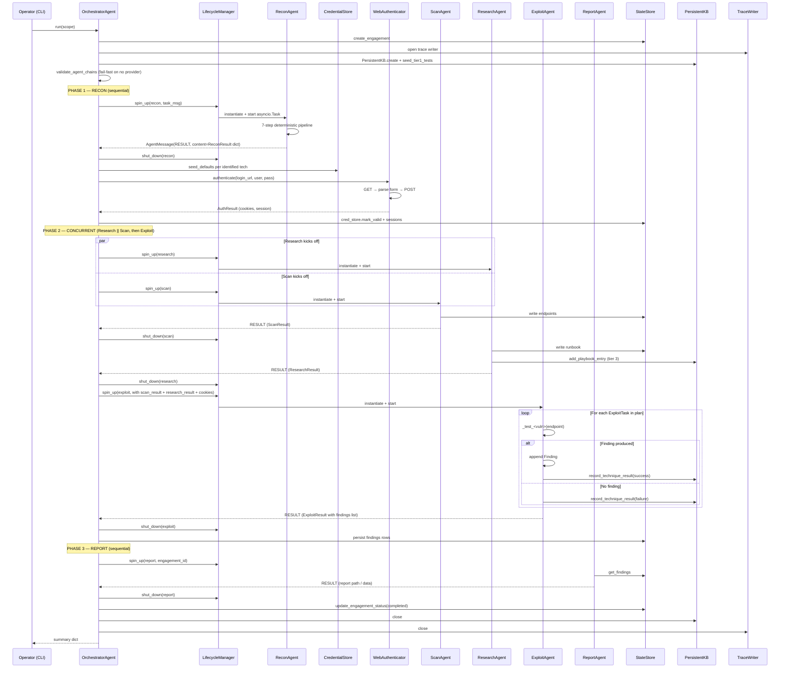
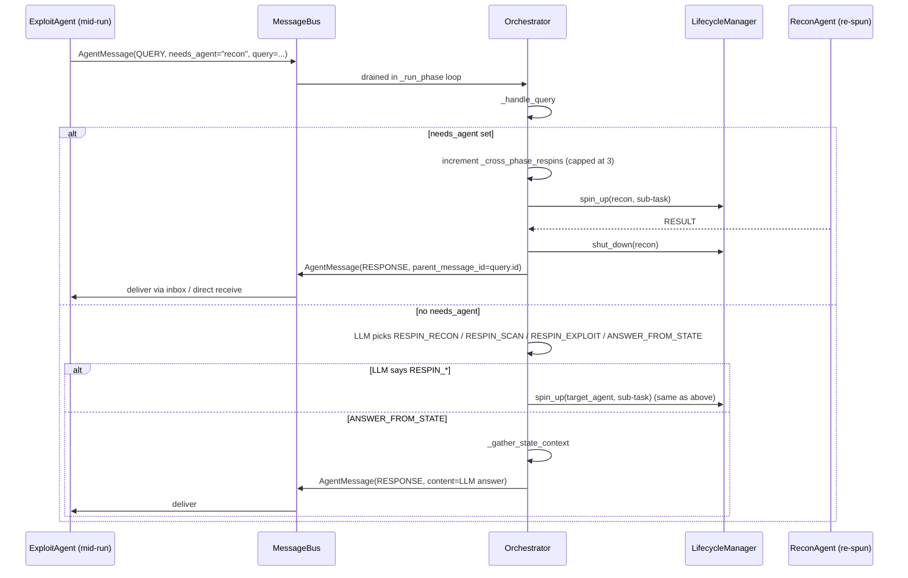
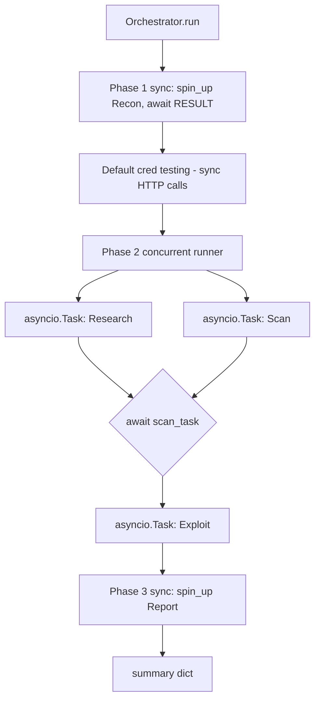

# Clinkz v2 — Control Flow Analysis

Date: 2026-05-06
Source: `src/clinkz/orchestrator/orchestrator.py`,
`src/clinkz/orchestrator/lifecycle.py`, `src/clinkz/agents/base.py`.

This document maps the actual sequence of agent spin-ups, concurrent
tasks, message routing, and termination conditions for
`OrchestratorAgent.run()`. It cross-references the planned flow in
`CLINKZ_V2_IMPLEMENTATION.md` and flags drift.

## Sequence — happy path



## Sequence — cross-phase QUERY (re-spin)



## Termination Conditions

The engagement ends when one of these fires:

| Condition | Where | Outcome |
|---|---|---|
| All three macro-phases return RESULT | orchestrator.py:147–356 | `summary["status"]="completed"`, status row marked completed |
| Any phase raises | orchestrator.py:340 try/except | `summary["status"]="failed"`, engagement marked failed, KB & trace closed in `finally` |
| `_PHASE_TIMEOUT` (600s) for a single phase (recon/scan/report; research uses its own budget+grace) | `_run_phase` | Phase returns `{"status":"timeout"}`, agent shut down, but the engagement continues to the next phase. The next phase consumes the (empty) result. **The exploit phase is exempt by default** — it passes `phase_timeout=inf` (no hard cap) and no cooperative deadline, so its full task queue runs to completion. Operation-level timeouts (per HTTP request, per tool subprocess, per LLM call via `LLM_REQUEST_TIMEOUT`) are the safety valve. Set `EXPLOIT_PHASE_BUDGET>0` to re-arm the old cooperative-stop + `budget+grace` hard cap. |
| Recon returns error | orchestrator.py:246 | `_build_fallback_recon` synthesises a minimal `ReconResult` from the scope target so downstream phases can still run |
| Exploit Agent stops without RESULT | orchestrator.py:606 | Returns `{"status":"agent_stopped"}` |
| `MAX_CROSS_PHASE_RESPINS` (3) hit | orchestrator.py:747 | `_handle_query` falls through to "answer from state"; no more re-spins this engagement |
| Iteration limit per agent | base.py:744 | Returns `"Max iterations reached without a final answer."` as the agent's final answer (string), Orchestrator gets it in RESULT and proceeds |

## Concurrency



The actual code in `_run_concurrent_phase` (orchestrator.py:394) starts
Research + Scan as `asyncio.create_task`. It then `await scan_task`,
then `await research_task`, then runs Exploit sequentially (after both
completed). So Research is concurrent with Scan only — Exploit waits
for both.

This is **less concurrent than the implementation plan** specifies.
`CLINKZ_V2_IMPLEMENTATION.md:66` says:

> "Start Scan + Research + Exploit concurrently. Monitor completion →
> stop all when done"

But the code starts Exploit **after** Scan and Research finish. Exploit
needs the runbook (Research output) and endpoint list (Scan output) as
input to its planning step, so this serialization is correct *for the
current input model*. Drift acknowledged below.

## Deadlock Potential

| Scenario | Risk | Status |
|---|---|---|
| `MessageBus.get_pending` waits forever for a sender that never sends | M | ✅ `_PHASE_TIMEOUT` and per-iteration polling (`_POLL_INTERVAL = 1s`) prevent this |
| `request_help` from agent A times out because Orchestrator is busy in another phase runner draining its own queue | L | ⚠️ The Orchestrator has one `ORCHESTRATOR` queue. When agent A's `_run_phase` sees a message from agent B, it re-queues it (orchestrator.py:625). If B is no longer running, the message is dropped. So messages from a *currently-stopped* agent leak. Mitigated for the running case. |
| Phase 2: Scan's `_run_phase` task and Research's `_run_phase` task both polling the same orchestrator queue | M | ✅ Re-queue logic at orchestrator.py:625 + 1s sleep at orchestrator.py:677 prevents busy-loop. |
| `_cross_phase_respins` counter shared across phases — Phase 2 might exhaust the budget before Phase 3 even runs | L | ⚠️ Today the budget is global. A Research-Agent that asks a lot of questions starves Exploit's re-spin capacity. |
| `request_help` waits 120s on a response that never arrives because Orchestrator returned early | L | ✅ `request_help` has its own timeout (base.py:426) and returns a fallback string. |

## Retry / Timeout Boundaries

| Layer | Retry? | Timeout |
|---|---|---|
| Subprocess execution | No | `tool_timeout = 300s` (config.py:72) |
| LLM call (per-provider) | Yes — `llm_max_retries = 3` with exponential backoff | `llm_retry_max_delay = 30s` cap on backoff |
| LLM call (cross-provider) | `ResilientLLMClient` rotates through fallback chain on RateLimit / ServiceUnavailable | n/a |
| WebAuthenticator | 2 attempts (auth.py:354) — second uses fresh GET for new CSRF | `timeout=30s` |
| `_run_phase` per phase | No retry; on error returns error dict | `_PHASE_TIMEOUT = 600s` |
| `_react_loop` per agent | `max_iterations` per agent (recon=20, scan=20, exploit=40, research=10, report=10) | n/a |
| `request_help` waits | Polls every 0.25s | 120s |
| `_cross_phase_respins` | Cap at 3 per engagement | n/a |
| Mid-run repetition | Same tool+args 3× → redirect prompt | same URL across tools 3× → redirect prompt |
| Mid-run failure | Same tool+error 3× → skip directive | n/a |

## Error Propagation

```mermaid
flowchart LR
    Tool[Tool execute fails] -->|exception caught| Wrapper[base.py _execute_tool]
    Wrapper -->|f'Tool ... failed: {exc}'| Loop[ReAct loop]
    Loop -->|3rd same failure| Skip[Skip directive injected]
    Loop -->|continues| Reason[Next reasoning step]

    LLMErr[LLM RateLimit/Unavailable] --> Resilient[ResilientLLMClient]
    Resilient -->|cycles chain| NextProvider[Next provider]
    Resilient -->|all chain failed| LLMUnavail[LLMUnavailableError raised]
    LLMUnavail --> Agent[Agent.run raises]
    Agent --> LM[LifecycleManager catches]
    LM -->|sends ERROR msg| Bus[MessageBus]
    Bus --> Orch[Orchestrator _run_phase sees ERROR]
    Orch -->|returns error dict| Outer[run() outer try]
    Outer -->|continues to next phase| Recover[Phase 3 still runs]

    PhaseTimeout[600s phase timeout] --> Orch
    Orch -->|shut_down + return timeout dict| Outer

    OrchExc[Unexpected exception in Orch] --> Outer
    Outer -->|catches, marks engagement failed| End[returns summary]
```

Errors at each layer are designed to *contain*, not abort:

- Tool failure → string in tool result, agent continues
- LLM provider failure → fallback chain, then `LLMUnavailableError`
- Agent crash → ERROR message → phase returns error dict → next phase
  still runs (with empty input)
- Recon error → `_build_fallback_recon` synthesises a minimal recon
  result so Phase 2 can continue
- Exception in `Orchestrator.run` → engagement marked failed but `finally`
  still closes KB + trace

This is robust but **occasionally over-tolerant** — Phase 3 will run
even with empty input, producing an empty report. There's no
"don't bother running the report if everything before it timed out"
short-circuit.

## Drift vs CLINKZ_V2_IMPLEMENTATION.md

| Plan says | Code does | Drift severity |
|---|---|---|
| "Start Scan + Research + Exploit concurrently" | Starts Research + Scan concurrently; Exploit waits for both | Intentional — Exploit needs Scan+Research as input. Plan needs updating to match. |
| "Try default credentials (WebAuthenticator)" between Recon and Phase 2 | Done — orchestrator.py:257 | ✅ Match |
| "Recon: 5-step deterministic pipeline (port, LLM, service, LLM, structure)" | Recon: 7-step (port, LLM, service, LLM, web recon, LLM, structure) — see recon.py docstring | Plan undercounts; web recon and final synthesis added. |
| "Monitor completion → stop all when done" with poll loop | No 10s poll loop — single `await scan_task; await research_task; run exploit` | ✅ Cleaner than the plan; the plan's poll loop was unnecessary given asyncio.Task. |
| "Post-engagement: commit results to persistent KB" | Per-task `record_technique_result` happens inside Exploit, not as a discrete post-engagement step | Minor — the plan's "commit at end" is now scattered through Exploit. |
| "Recon retry / re-spin if Exploit needs more intel" | Implemented via `_handle_query` + re-spin (orchestrator.py:684) | ✅ Match |
| "Critic Agent reviews findings before report" | `CriticAgent` existed but was never called by `Orchestrator.run` | ✅ **RESOLVED 2026-08-19 — archived, not wired.** Confirmed at 0 invocations across 2,774 recorded agent steps. Moved to `agents/_archive/critic.py` and removed from `_AGENT_CLASSES`; see "Actionable Findings" #1 below. |

## Actionable Findings

1. ~~**Wire Critic into the flow.**~~ **RESOLVED 2026-08-19 in the other
   direction: archived.** The recommendation assumed the missing piece was the
   wiring. It was not — the *job* had already moved onto the emitting path and
   somewhere stricter, so wiring an LLM reviewer in after those gates could only
   let it overrule them, which the invariants forbid in that direction. FP
   elimination is `_mark_false_positive_suspects` +
   `_fp_deterministic_contradiction` (a demotion must name a deterministic
   contradiction in the evidence); evidence/repro sufficiency is
   `verification_strength` enforced at `_persist_finding`; CVSS is computed in
   the report. `agents/_archive/critic.py` keeps the code and the reasoning.
2. **Update CLINKZ_V2_IMPLEMENTATION.md to match code.** Step counts
   (Recon 5 → 7), concurrency wording (Exploit is sequential after
   Scan+Research), and "monitor completion poll loop" wording all
   diverge from the code.
3. **Per-phase re-spin budget.** `_cross_phase_respins` is global today
   (orchestrator.py:136). Split it by requesting-agent so Research
   asking 3 questions doesn't starve Exploit.
4. **Short-circuit Phase 3 on empty Phase 2 results.** Today an
   exploit-phase timeout still triggers a full Report run with no
   findings — wasted LLM cost, confusing "successful" report. Add a
   conditional: skip report if `summary["phases"]["exploit"]["status"]`
   is timeout/error and zero findings persisted.
5. **Document the orchestrator queue ownership rule.** When Phase 2
   has Scan + Research running concurrently, both `_run_phase` tasks
   poll `bus.get_pending(ORCHESTRATOR)`. The re-queue logic works but
   is subtle — leave a comment block explaining the design.
