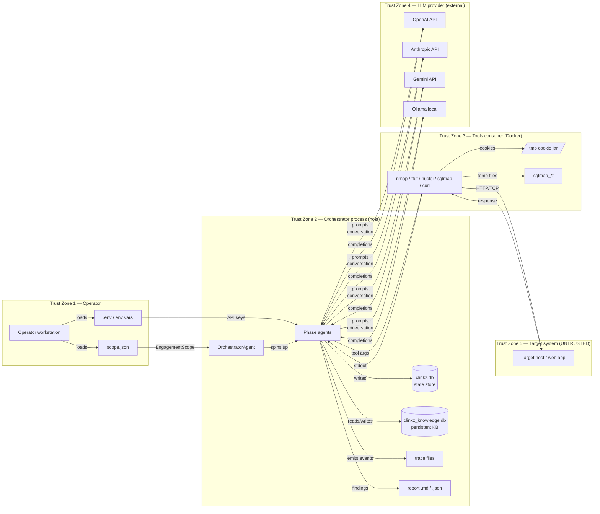
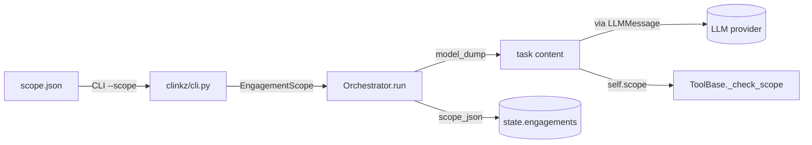
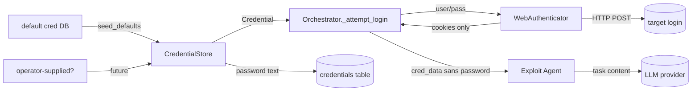
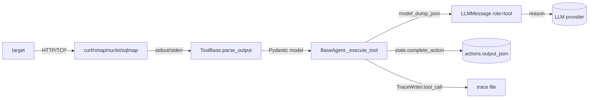
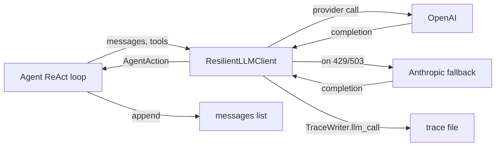
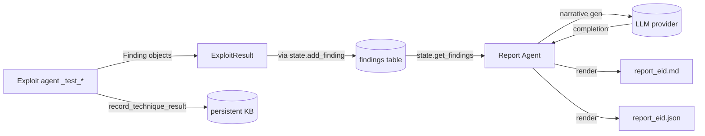
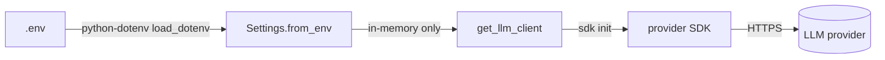
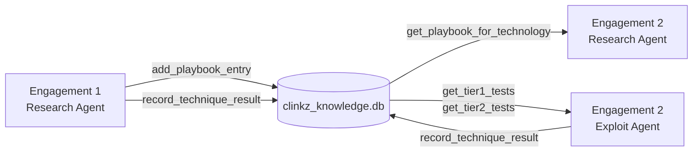

# Clinkz v2 — Data Flow Diagram

Date: 2026-05-06
Purpose: track sensitive data through the system, identify trust-zone
boundaries, and surface where data is stored, transmitted, or exposed.

## Trust Zones



Crossings to be paranoid about:

| Boundary | Direction | What flows | Risk |
|---|---|---|---|
| TZ2 → TZ4 | out | prompts, conversation history, tool output, scope | Provider sees engagement details |
| TZ3 → TZ2 | in | parsed tool output (was target-controlled) | Prompt injection upstream |
| TZ5 → TZ3 → TZ2 → TZ4 | in/out | target HTML/headers ends up in LLM | The whole stack must treat this as untrusted |
| TZ2 → TZ3 | out | docker-exec argv (LLM-derived) | Argv must be list-form, scope-checked |
| TZ1 → TZ2 | in | API keys via env | Never logged, never sent to LLM |

---

## Sensitive Data Catalog

For each datum: where it enters, where it's stored, where it's
transmitted, where it leaves.

### 1. Engagement Scope (`EngagementScope` model)



- **Enters:** operator-supplied JSON file
- **Stored:** `engagements.scope_json` in `clinkz.db`; in-memory on every
  agent instance
- **Transmitted:** to LLM provider as part of agent task content
- **Leaves:** never leaves the process boundary except as part of LLM
  prompts and the final report's metadata

Boundary crossings: TZ1 → TZ2 → TZ4 (the LLM sees the scope).

### 2. Credentials (username + password)



- **Enters:** `CredentialStore.seed_defaults` (e.g. DVWA `admin:password`,
  Tomcat `tomcat:tomcat`); operator entry not yet wired
- **Stored:** `credentials` table in `clinkz.db` — **plaintext password**
- **Transmitted:** to the target login endpoint via `WebAuthenticator`;
  to the LLM, **only the username** (orchestrator.py:516,
  `authenticated_as`)
- **Leaves:** never to the LLM; lives on disk in `clinkz.db` until it's
  deleted

⚠️ **The LLM never sees the password by current code paths.** This is
load-bearing — there is no test asserting it. See threat model A-5,
S-4.

### 3. Session Cookies

```mermaid
flowchart LR
    AUTH[WebAuthenticator] -->|Set-Cookie| AUTH
    AUTH -->|cookies dict| CSTORE[CredentialStore.mark_valid]
    CSTORE -->|sessions row| STATE[(sessions.cookies_json)]
    AUTH -->|cookies dict| ORCH
    ORCH -->|exploit_content.session_cookies| EXPLOIT[Exploit Agent]
    EXPLOIT -->|in LLMMessage| LLM[(LLM provider)]
    AUTH -->|cookie jar file| CONTAINER[/tmp/clinkz_eid_cookies.txt]
    CONTAINER -->|curl -b| HTTP[curl in container]
```

- **Enters:** `Set-Cookie` headers from the target (TZ5)
- **Stored:** plaintext in `sessions.cookies_json` (state DB) **and**
  Netscape jar inside the tools container at
  `/tmp/clinkz_<engagement_id>_cookies.txt`
- **Transmitted:** verbatim to the LLM (orchestrator.py:511); to the
  target on every authenticated request
- **Leaves:** TLS to LLM provider; never to disk outside the project /
  container

🔴 Cookies in LLM prompts is an architectural choice, not a bug. Worth
making explicit in operator docs.

### 4. Tool Output (target-controlled bytes)



- **Enters:** subprocess stdout from a tool that just talked to the
  target (TZ5 → TZ3 → TZ2)
- **Stored:** `actions.output_json` in state DB; trace file
- **Transmitted:** to the LLM provider in every subsequent reasoning
  step (the conversation grows monotonically until iteration limit)
- **Leaves:** TLS to LLM; lives in trace files on disk

🔴 This is the biggest exposure: target-controlled bytes go to four
places (state DB, trace, LLM, eventually report). No redaction.

### 5. LLM Prompts and Completions



- **Enters:** task description + accumulated conversation
- **Stored:** in-memory `self.messages` per agent run; trace file
- **Transmitted:** every prompt (including system prompt + all prior
  tool outputs + scope + creds *if* in conversation) goes to the
  configured provider
- **Leaves:** to TZ4 over TLS

Per-agent provider mapping (config.py:47–51):

| Agent | Default provider | Profile |
|---|---|---|
| Recon | gemini | fast |
| Scan | gemini | fast |
| Report | gemini | fast |
| Exploit | anthropic | reasoning |
| Research | anthropic | reasoning |

Cost-and-data tradeoff: the heaviest per-request cost is the Exploit
conversation (which contains scan results, recon results, research
runbook, session cookies — see orchestrator.py:491-516). Anthropic sees
the full attack-surface map.

### 6. Findings



- **Enters:** `_test_*` methods discover and construct `Finding` models
- **Stored:** `findings` table in state DB; `technique_results` table
  in persistent KB; rendered into `report_<eid>.{md,json}` files in
  the project root
- **Transmitted:** to the LLM in the Report Agent's narrative-generation
  pass
- **Leaves:** the project root contains hundreds of `report_*.json/.md`
  files (see git status) — these accumulate forever

⚠️ Findings reference target URLs, request/response evidence, and
technology stacks — all sensitive. The report files are not
git-ignored; recommend an `outputs/` dir + `.gitignore` rule.

### 7. API Keys



- **Enters:** `.env` or shell env (config.py:17)
- **Stored:** in-memory only (`Settings` instance)
- **Transmitted:** to the provider SDK, which sends as a request header
  over TLS
- **Leaves:** never written to disk by Clinkz; never logged (verified
  by reading config.py and llm clients)

✅ This is the cleanest sensitive-data path in the system.

---

## Persistent Knowledge Base — special case

The KB is the only data store that **survives across engagements**. That
makes it the only place where data from engagement N can affect
engagement N+1 without operator action.



What persists:

- `playbook_entries` — technique definitions including `steps` (free-text
  list, executable instructions for future agents) and `technology_pattern`
  (regex evaluated on every future query)
- `technique_results` — per-engagement success/failure; informs ranking
- `technology_relations` — similarity edges between tech stacks
- `past_engagements` — engagement summaries with target description and
  findings summary

Cross-tenant exposure: an operator using Clinkz across multiple clients
has all clients' summaries in `past_engagements.findings_summary` and
`target_description`. **Recommend per-client KB instances** (i.e. a
per-engagement `--kb-path` flag) for production use.

---

## Actionable Findings

1. **Add `outputs/` directory + `.gitignore` for `report_*.json`,
   `report_*.md`, `clinkz.db`, `clinkz_knowledge.db`, `sqlmap_*/`.**
   Today the repo root accumulates them; some are committed by accident
   risk. Status (git status as of now): 4 untracked `sqlmap_*` dirs
   already.
2. **Mark tool output as untrusted in LLM messages.** Wrap parsed
   output JSON in `<untrusted_target_output>...</untrusted_target_output>`
   tags inside the `role="tool"` content; add a system-prompt clause that
   instructions inside those tags are not commands.
3. **Encrypt `sessions.cookies_json` and `credentials.password`.**
   Today both sit plaintext in `clinkz.db`. A simple Fernet key derived
   from a `CLINKZ_DB_KEY` env var is enough; key rotation can come later.
4. **Per-engagement persistent KB option.** Add a `--kb-path` CLI flag
   so operators can isolate one client's playbook from another. Default
   stays the shared `clinkz_knowledge.db` for solo use.
5. **Redact basic-auth and `Set-Cookie` values in tool output before
   building the LLM message.** A 30-line filter inside `BaseAgent._execute_tool`.
